# PROJECT CHRONOS — DATABASE SPECIFICATION & ARCHITECTURE
**Document**: `database.md`  
**Location**: `docs/database.md`  
**Engine**: SQLite (Single Central Server, RDBMS with Foreign Keys Enabled)

---

## 1. Executive Summary
Project Chronos uses a single, centralized SQLite relational database on the main LAN server. A master `teams` table acts as the unified source of truth for participant PRNs, live timestamps, round timings, individual round scores, and computed total scores. Flexible secondary tables support Round 1 (image-based puzzle items and classification submissions), Round 2 (text logs, investigation memos, and AI chat transcripts), and Round 3 (team case assignments and final decisions). The system ensures real-time score synchronization, atomic transactions, and one-click export of any table to CSV for event administrators.

---

## 2. Database Description & System Architecture

### 2.1 Centralized Storage Model
Project Chronos employs a single, centralized relational database engine (`SQLite3`) hosted directly on the central LAN server (`chronos.db`). Player workstations across the venue connect to this unified database via the FastAPI backend. Individual player PCs **never** run isolated local databases.

### 2.2 Table Roles & Data Segregation
The schema is partitioned into functional subsystems:
1. **Master Core (`teams`)**: Persists team registration credentials, PRNs, state machine status, individual round timestamps, and aggregated scores.
2. **Round 1 Subsystem (`round1_items`, `round1_submissions`)**: Manages the 25 technology puzzle images, correct historical era classifications (`PAST`, `PRESENT`, `FUTURE`), and individual team answers with $+2/-1$ scoring.
3. **Round 2 Subsystem (`round2_files`, `round2_chat_messages`, `round2_submissions`)**: Manages project text audit logs (Alpha, Beta, Gamma), tracks restricted Gemini AI assistant queries (deducting 5, 5, 10 points), and records culprit findings.
4. **Round 3 Subsystem (`round3_team_cases`, `round3_submissions`)**: Stores procedurally generated/seeded case assignments to prevent cross-team answer leakage and records final culprit and supporting evidence submissions ($+30$ points).
5. **Telemetry & Audit Subsystem (`game_logs`)**: Records time-stamped system events, logins, transitions, and errors for live admin monitoring.

### 2.3 Concurrency, Locking & Integrity Constraints
* **Foreign Key Support**: Foreign key enforcement is explicitly activated on every SQLite connection (`PRAGMA foreign_keys = ON;`).
* **Write-Ahead Logging (WAL)**: Enabled by default (`PRAGMA journal_mode = WAL;`) allowing concurrent reads while writes are processed atomically.
* **Busy Timeout & Lock Resistance**: `PRAGMA busy_timeout = 30000;` (30 seconds) along with `sqlite3.connect(..., timeout=30.0)` prevents "database is locked" operational errors under concurrent LAN traffic.
* **Synchronous Optimization**: `PRAGMA synchronous = NORMAL;` optimizes disk sync operations in WAL mode without risking database corruption.
* **Dynamic Path Resolution**: Configurable via `CHRONOS_DB_PATH` environment variable with automated directory creation upon startup.
* **Cascading Integrity**: Child tables linked to `team_id` enforce `ON DELETE CASCADE` to maintain relational cleanliness.
* **Server-Authoritative Scores**: The backend recalculates `total_score` and `r1_time_diff` atomically within database transactions, preventing client-side score manipulation.

---

## 3. Entity-Relationship (ER) Diagram

```mermaid
erDiagram
    teams ||--o{ round1_submissions : "submits (1:N)"
    teams ||--o{ round2_chat_messages : "queries (1:N)"
    teams ||--o{ round2_submissions : "submits (1:N)"
    teams ||--o| round3_team_cases : "assigned (1:1)"
    teams ||--o{ round3_submissions : "submits (1:N)"
    teams ||--o{ game_logs : "generates (1:N)"
    round1_items ||--o{ round1_submissions : "classified in (1:N)"

    teams {
        int team_id PK "Auto-increment Primary Key"
        string team_name UK "Unique Team Name"
        string member1_name "Participant 1 Full Name"
        string member2_name "Participant 2 Full Name"
        string member1_prn "Participant 1 PRN"
        string member2_prn "Participant 2 PRN"
        datetime r1_start_time "Round 1 Start Timestamp"
        datetime r1_end_time "Round 1 Completion Timestamp"
        float r1_time_diff "Round 1 Duration in Seconds"
        float r1_score "Round 1 Raw Score"
        float r1_scaled "Round 1 Scaled Score"
        float r2_score "Round 2 Score (Max 50)"
        float r3_score "Round 3 Score (Max 30)"
        float total_score "Total Cumulative Score (Max 130)"
        string status "ACTIVE | FINISHED | DISQUALIFIED"
        string current_state "State Machine Status"
        datetime created_at "Registration Timestamp"
        datetime updated_at "Last Update Timestamp"
    }

    round1_items {
        int item_id PK "Item Identifier"
        string item_name "Technology Name"
        string image_path "Path to Image Asset"
        string correct_era "PAST | PRESENT | FUTURE"
        string clue_text "Lore / Descriptive Text"
        float points_positive "Points for Correct (+2.0)"
        float points_negative "Penalty for Incorrect (-1.0)"
        int is_active "Active Flag (1/0)"
    }

    round1_submissions {
        int id PK "Submission Record ID"
        int team_id FK "References teams(team_id)"
        int item_id FK "References round1_items(item_id)"
        string selected_era "PAST | PRESENT | FUTURE"
        int is_correct "1 if Correct, 0 if Wrong"
        float points_awarded "Score Change (+2.0 / -1.0)"
        datetime submitted_at "Submission Timestamp"
    }

    round2_files {
        string file_id PK "Alpha / Beta / Gamma File ID"
        string project_name "Project Name"
        string timeline_tag "FUTURE | PRESENT | PAST"
        string filename "e.g. future_audit.log"
        string content_text "Textual Investigation Content"
        int is_locked "Locked Flag (1/0)"
    }

    round2_chat_messages {
        int id PK "Chat Message ID"
        int team_id FK "References teams(team_id)"
        int question_number "Question Index (1, 2, or 3)"
        string user_prompt "Participant Investigation Query"
        string ai_response "Restricted AI Assistant Response"
        float points_deducted "Deduction (5.0, 5.0, 10.0)"
        datetime created_at "Query Timestamp"
    }

    round2_submissions {
        int id PK "Round 2 Record ID"
        int team_id FK "References teams(team_id)"
        string suspect_identified "Identified Culprit"
        int is_correct "1 if Correct (+30), 0 if Wrong"
        float points_awarded "Culprit Score (30.0 or 0.0)"
        float ai_points_remaining "Remaining AI Points (Max 20.0)"
        float round2_total_score "Total R2 Score (Max 50.0)"
        datetime submitted_at "Submission Timestamp"
    }

    round3_team_cases {
        int id PK "Case Assignment Record ID"
        int team_id FK, UK "References teams(team_id)"
        string case_id "Assigned Procedural Case ID"
        string culprit_candidate_id "Secret Guilty Candidate ID"
        string valid_evidence_ids "JSON Array of Valid Evidence IDs"
        datetime assigned_at "Case Generation Timestamp"
    }

    round3_submissions {
        int id PK "Round 3 Record ID"
        int team_id FK "References teams(team_id)"
        string selected_candidate_id "Accused Candidate ID"
        string selected_evidence_ids "JSON Array of Selected Evidence"
        int is_correct "1 if Correct (+30), 0 if Wrong"
        float points_awarded "Score Change (+30.0 or 0.0)"
        datetime submitted_at "Submission Timestamp"
    }

    game_logs {
        int log_id PK "Audit Log ID"
        int team_id FK "References teams(team_id)"
        string event_type "Event Category Type"
        string event_data "JSON Event Payload"
        datetime created_at "Log Event Timestamp"
    }
```



---

## 4. SQL DDL Schema (Vibecoding & AI Ready)

### 4.1 Central Master Table: `teams`
The master record for each registered team, tracking identity, PRNs, live timestamps, durations, scores, and status.

```sql
CREATE TABLE IF NOT EXISTS teams (
    team_id INTEGER PRIMARY KEY AUTOINCREMENT,
    team_name TEXT NOT NULL UNIQUE,
    member1_name TEXT NOT NULL,
    member2_name TEXT NOT NULL,
    member1_prn TEXT NOT NULL,
    member2_prn TEXT NOT NULL,
    
    -- Round 1 Timings & Scores
    r1_start_time DATETIME,
    r1_end_time DATETIME,
    r1_time_diff FLOAT,                  -- Duration in seconds (e.g. 142.50)
    r1_score FLOAT DEFAULT 0.0,          -- Raw points (+2 / -1)
    r1_scaled FLOAT DEFAULT 0.0,         -- Scaled/normalized score if applicable
    
    -- Round 2 & Round 3 Scores
    r2_score FLOAT DEFAULT 0.0,          -- Investigation (max 50: 30 culprit + 20 AI balance)
    r3_score FLOAT DEFAULT 0.0,          -- Final Decision (max 30)
    total_score FLOAT DEFAULT 0.0,       -- Sum of r1_score/r1_scaled + r2_score + r3_score
    
    -- Game Progression & Timestamps
    status TEXT DEFAULT 'ACTIVE' CHECK(status IN ('ACTIVE', 'FINISHED', 'DISQUALIFIED')),
    current_state TEXT DEFAULT 'REGISTERED',
    created_at DATETIME DEFAULT CURRENT_TIMESTAMP,
    updated_at DATETIME DEFAULT CURRENT_TIMESTAMP
);
```

---

### 4.2 Round 1 Tables: Image Puzzles & Classifications
Round 1 stores technology images, correct eras (PAST, PRESENT, FUTURE), and per-team classifications.

```sql
-- Catalog of 25 Technology Classification Items
CREATE TABLE IF NOT EXISTS round1_items (
    item_id INTEGER PRIMARY KEY AUTOINCREMENT,
    item_name TEXT NOT NULL,
    image_path TEXT NOT NULL,             -- URL or static asset path (e.g., '/images/r1/quantum_cpu.png')
    correct_era TEXT NOT NULL CHECK(correct_era IN ('PAST', 'PRESENT', 'FUTURE')),
    clue_text TEXT,                       -- Optional description or lore snippet
    points_positive FLOAT DEFAULT 2.0,    -- +2 points for correct classification
    points_negative FLOAT DEFAULT 1.0,    -- -1 point for incorrect classification
    is_active INTEGER DEFAULT 1
);

-- Team Submissions for Round 1
CREATE TABLE IF NOT EXISTS round1_submissions (
    id INTEGER PRIMARY KEY AUTOINCREMENT,
    team_id INTEGER NOT NULL,
    item_id INTEGER NOT NULL,
    selected_era TEXT NOT NULL CHECK(selected_era IN ('PAST', 'PRESENT', 'FUTURE')),
    is_correct INTEGER NOT NULL,          -- 1 = Correct, 0 = Incorrect
    points_awarded FLOAT NOT NULL,        -- +2.0 or -1.0
    submitted_at DATETIME DEFAULT CURRENT_TIMESTAMP,
    FOREIGN KEY (team_id) REFERENCES teams(team_id) ON DELETE CASCADE,
    FOREIGN KEY (item_id) REFERENCES round1_items(item_id)
);
```

---

### 4.3 Round 2 Tables: Text Logs, Evidence & AI Chat
Round 2 contains textual evidence files (Alpha, Beta, Gamma) and records restricted AI chat queries (max 3 questions).

```sql
-- Textual Investigation Evidence Files
CREATE TABLE IF NOT EXISTS round2_files (
    file_id TEXT PRIMARY KEY,             -- e.g., 'PROJECT_ALPHA_AUDIT', 'PROJECT_BETA_INCIDENT'
    project_name TEXT NOT NULL,           -- 'PROJECT ALPHA', 'PROJECT BETA', 'PROJECT GAMMA'
    timeline_tag TEXT NOT NULL,           -- 'FUTURE', 'PRESENT', 'PAST'
    filename TEXT NOT NULL,               -- e.g., 'future_audit.log'
    content_text TEXT NOT NULL,           -- Detailed log/incident content
    is_locked INTEGER DEFAULT 0
);

-- AI Assistant Interaction Log & Deductions
CREATE TABLE IF NOT EXISTS round2_chat_messages (
    id INTEGER PRIMARY KEY AUTOINCREMENT,
    team_id INTEGER NOT NULL,
    question_number INTEGER NOT NULL,     -- 1, 2, or 3
    user_prompt TEXT NOT NULL,            -- Participant query
    ai_response TEXT NOT NULL,            -- Restricted Assistant response
    points_deducted FLOAT NOT NULL,       -- Q1: 5.0, Q2: 5.0, Q3: 10.0
    created_at DATETIME DEFAULT CURRENT_TIMESTAMP,
    FOREIGN KEY (team_id) REFERENCES teams(team_id) ON DELETE CASCADE
);

-- Round 2 Culprit Investigation Submission
CREATE TABLE IF NOT EXISTS round2_submissions (
    id INTEGER PRIMARY KEY AUTOINCREMENT,
    team_id INTEGER NOT NULL,
    suspect_identified TEXT NOT NULL,
    is_correct INTEGER NOT NULL,          -- 1 = Correct (+30), 0 = Incorrect (0)
    points_awarded FLOAT NOT NULL,
    ai_points_remaining FLOAT NOT NULL,   -- Starting 20.0 minus deductions
    round2_total_score FLOAT NOT NULL,    -- points_awarded + ai_points_remaining
    submitted_at DATETIME DEFAULT CURRENT_TIMESTAMP,
    FOREIGN KEY (team_id) REFERENCES teams(team_id) ON DELETE CASCADE
);
```

---

### 4.4 Round 3 Tables: Dynamic Cases & Final Decision
Round 3 assigns a dynamically seeded scenario to each team and validates culprit and supporting evidence selection.

```sql
-- Team Case Assignment (Seeded Case Mapping)
CREATE TABLE IF NOT EXISTS round3_team_cases (
    id INTEGER PRIMARY KEY AUTOINCREMENT,
    team_id INTEGER UNIQUE NOT NULL,
    case_id TEXT NOT NULL,
    culprit_candidate_id TEXT NOT NULL,   -- True culprit for this specific team
    valid_evidence_ids TEXT NOT NULL,     -- JSON array e.g. '["ev_timeline", "ev_auth"]'
    assigned_at DATETIME DEFAULT CURRENT_TIMESTAMP,
    FOREIGN KEY (team_id) REFERENCES teams(team_id) ON DELETE CASCADE
);

-- Final Decision Submissions
CREATE TABLE IF NOT EXISTS round3_submissions (
    id INTEGER PRIMARY KEY AUTOINCREMENT,
    team_id INTEGER NOT NULL,
    selected_candidate_id TEXT NOT NULL,
    selected_evidence_ids TEXT NOT NULL,  -- JSON array of selected evidence
    is_correct INTEGER NOT NULL,          -- 1 = +30 points, 0 = 0 points
    points_awarded FLOAT NOT NULL,
    submitted_at DATETIME DEFAULT CURRENT_TIMESTAMP,
    FOREIGN KEY (team_id) REFERENCES teams(team_id) ON DELETE CASCADE
);
```

---

### 4.5 Global Audit Table: `game_logs`
Tracks state changes, network actions, and lifecycle events for real-time monitoring and replay.

```sql
CREATE TABLE IF NOT EXISTS game_logs (
    log_id INTEGER PRIMARY KEY AUTOINCREMENT,
    team_id INTEGER,
    event_type TEXT NOT NULL,             -- 'LOGIN', 'R1_COMPLETE', 'R2_CHAT', 'R3_SUBMIT', etc.
    event_data TEXT,                      -- JSON metadata payload
    created_at DATETIME DEFAULT CURRENT_TIMESTAMP,
    FOREIGN KEY (team_id) REFERENCES teams(team_id) ON DELETE SET NULL
);
```

---

## 5. Automatic Synchronization & Score Calculations

Whenever round scores or timestamps update, the master `teams` table is updated atomically.

### Python Database Service Helper (`backend/app/database/queries.py`)
```python
import sqlite3
from datetime import datetime

def update_team_scores(connection: sqlite3.Connection, team_id: int):
    """Recomputes total_score and updates the master teams table."""
    cursor = connection.cursor()
    cursor.execute("""
        UPDATE teams
        SET total_score = ROUND(COALESCE(r1_score, 0.0) + COALESCE(r2_score, 0.0) + COALESCE(r3_score, 0.0), 2),
            updated_at = CURRENT_TIMESTAMP
        WHERE team_id = ?
    """, (team_id,))
    connection.commit()

def record_round1_completion(connection: sqlite3.Connection, team_id: int, r1_score: float, start_time: datetime, end_time: datetime):
    """Computes duration in seconds and updates Round 1 metrics."""
    time_diff = (end_time - start_time).total_seconds()
    cursor = connection.cursor()
    cursor.execute("""
        UPDATE teams
        SET r1_start_time = ?,
            r1_end_time = ?,
            r1_time_diff = ?,
            r1_score = ?,
            total_score = ROUND(? + COALESCE(r2_score, 0.0) + COALESCE(r3_score, 0.0), 2),
            updated_at = CURRENT_TIMESTAMP
        WHERE team_id = ?
    """, (start_time.isoformat(), end_time.isoformat(), round(time_diff, 2), r1_score, r1_score, team_id))
    connection.commit()
```

---

## 6. Easy CSV Export Functionality

Event administrators can export any table directly to CSV format at any time during or after the event.

### 6.1 Python Export Utility (`backend/app/utils/csv_export.py`)
```python
import csv
import io
import sqlite3
from backend.app.database.connection import get_connection

def export_table_to_csv(table_name: str = "teams") -> str:
    """Exports any database table to a CSV string format."""
    # Whitelist allowed tables to prevent SQL injection
    allowed_tables = {
        "teams", "round1_items", "round1_submissions",
        "round2_files", "round2_chat_messages", "round2_submissions",
        "round3_team_cases", "round3_submissions", "game_logs"
    }
    if table_name not in allowed_tables:
        raise ValueError(f"Table '{table_name}' is not permitted for export.")
        
    conn = get_connection()
    try:
        cursor = conn.cursor()
        cursor.execute(f"SELECT * FROM {table_name}")
        rows = cursor.fetchall()
        
        output = io.StringIO()
        writer = csv.writer(output)
        
        # Write column headers
        column_names = [description[0] for description in cursor.description]
        writer.writerow(column_names)
        
        # Write rows
        for row in rows:
            writer.writerow(list(row))
            
        return output.getvalue()
    finally:
        conn.close()
```

### 6.2 FastAPI Admin Endpoint (`backend/app/routes/admin.py`)
```python
from fastapi import APIRouter, Response
from backend.app.utils.csv_export import export_table_to_csv

router = APIRouter(prefix="/api/admin", tags=["Admin"])

@router.get("/export/csv/{table_name}")
def download_table_csv(table_name: str = "teams"):
    """Download live table data as a downloadable CSV file."""
    csv_data = export_table_to_csv(table_name)
    return Response(
        content=csv_data,
        media_type="text/csv",
        headers={"Content-Disposition": f"attachment; filename={table_name}_export.csv"}
    )
```

---

## 7. AI & Vibecoding Rules for Database Integration

1. **Foreign Key Enforcement**: Always ensure `PRAGMA foreign_keys = ON;` is executed on every new SQLite connection.
2. **Atomic Writes**: Always wrap multi-table score updates in transactions (`try... connection.commit() except... connection.rollback()`).
3. **No Direct Secret Exposure**: When fetching round data for frontend clients, never return `correct_era`, `culprit_candidate_id`, or `valid_evidence_ids`.
4. **Idempotency**: Submissions must check if an entry already exists for a `team_id` before awarding points.
5. **Standard Datetime Format**: Store all timestamps in UTC ISO 8601 strings (`YYYY-MM-DDTHH:MM:SSZ`) for seamless cross-platform parsing in Python and JavaScript.
