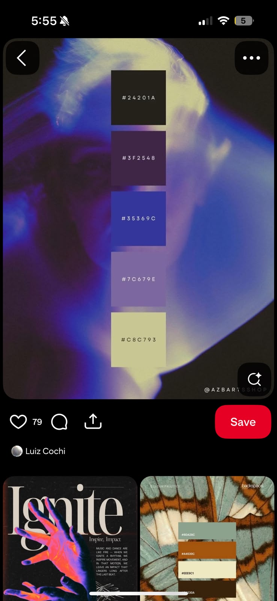

# Futuristic Game Web App — Color & Typography Theme

> **Aesthetic:** Dark atmospheric sci-fi + ultraviolet chromatic lighting + muted mineral tones + warm spectral highlights.

## Reference Image



---

## 1. Core Color Theme

The reference uses a dark, chromatic, neon-futuristic palette: deep warm charcoal, ultraviolet/plum shadows, saturated electric blue, muted lavender, and a warm desaturated yellow/cream highlight.

| Role | Color | Hex | Game/UI Use |
|---|---|---|---|
| **Obsidian** | Near-black warm charcoal | `#24201A` | Main background, HUD panels |
| **Deep Violet** | Dark plum | `#3F2548` | Secondary surfaces, cards |
| **Electric Indigo** | Saturated blue-violet | `#35369C` | Primary interactive/accent color |
| **Dusty Lavender** | Muted purple | `#7C679E` | Secondary accent, inactive states |
| **Solar Cream** | Pale yellow/olive cream | `#C8C793` | Highlights, rewards, important information |

### Palette

```text
#24201A  ██████████  Background
#3F2548  ████████    Secondary background
#35369C  ██████      Primary accent
#7C679E  █████       Secondary accent
#C8C793  ████        Highlight / reward
```

---

## 2. Recommended Game Design System

### Background — Obsidian

```css
--bg-primary: #24201A;
```

Use for:

- Application background
- Game arena surrounding area
- Main navigation
- HUD backdrop

Avoid pure `#000000`. The warm black creates a more atmospheric visual foundation.

### Surface — Deep Violet

```css
--bg-surface: #3F2548;
```

Use for:

- Cards
- Inventory
- Character panels
- Matchmaking panels
- Menus
- Modal backgrounds

Optional translucent surface:

```css
background: rgba(63, 37, 72, 0.72);
backdrop-filter: blur(16px);
```

---

## 3. Primary Interactive Color

### Electric Indigo

```css
--primary: #35369C;
```

This should become the functional identity of the game.

Use it for:

- Primary buttons
- Selected navigation
- Active player
- Health/energy indicators
- Ability selection
- Interactive objects
- Focus states
- Progress indicators

Do not apply it to every component. Reserve it primarily for interaction and gameplay state.

---

## 4. Secondary Tone

### Dusty Lavender

```css
--secondary: #7C679E;
```

Use for:

- Secondary buttons
- Disabled-but-visible UI
- NPC/player information
- Secondary statistics
- Borders
- Subtle gradients

### Primary Gradient

```css
background: linear-gradient(
    135deg,
    #3F2548,
    #35369C,
    #7C679E
);
```

This creates the characteristic purple → electric blue → lavender transition.

---

## 5. Highlight / Reward Color

### Solar Cream

```css
--highlight: #C8C793;
```

Use sparingly for:

- XP
- Coins
- Rewards
- Legendary items
- Critical information
- Achievement states
- Important text
- Victory indicators

Example:

```text
XP        2,450
COINS     1,280
RANK      S+
```

Use `#C8C793` for the numerical values or key information.

The cream acts as a warm counterpoint to the blue/violet palette and prevents the interface from becoming a generic neon cyberpunk UI.

---

# 6. Futuristic Font System

Use **two primary fonts** rather than one.

## Primary UI — Space Grotesk

**Space Grotesk** is recommended for:

- Menus
- Buttons
- Statistics
- Cards
- Settings
- General interface

It provides a futuristic geometric appearance while remaining highly readable.

### Weight system

```text
400 — Body
500 — UI
600 — Labels
700 — Headings
```

---

## Game Titles / Hero Text — Orbitron

**Orbitron** is recommended for:

- Game title
- Match number
- Player level
- Large HUD numbers
- Major section headings
- Futuristic status indicators

Avoid using Orbitron for long paragraphs because its geometric forms become less readable at small sizes.

Example:

```text
GAME TITLE
MISSION 07
LEVEL 42
SYSTEM ONLINE
```

---

# 7. Alternative Font Stacks

### More Cybernetic

```text
Headings: Orbitron
UI: Rajdhani
Body: Inter
```

### Premium / Modern Sci-Fi

```text
Headings: Space Grotesk
UI: Space Grotesk
Body: Sora
```

### Hard Sci-Fi

```text
Headings: Orbitron
UI: Space Grotesk
Body: Inter
```

### Competitive / Esports

```text
Headings: Oxanium
UI: Oxanium
Body: Inter
```

**Recommended overall combination:**

> **Orbitron + Space Grotesk**

---

# 8. Recommended Typography System

| Element | Font | Weight | Size | Letter Spacing |
|---|---|---:|---:|---:|
| Game Title | Orbitron | 700 | 48–72px | `0.04em` |
| Section Title | Space Grotesk | 700 | 24–32px | Normal |
| HUD / Stat Number | Orbitron | 600 | 28–48px | Normal |
| UI Label | Space Grotesk | 600 | 12–14px | `0.08em` |
| Body | Space Grotesk | 400 | 14–16px | Normal |
| Micro Label | Space Grotesk | 500 | 10–12px | `0.12em` |

---

# 9. Game UI Color Semantics

Treat the palette as a **state system**, rather than applying colors randomly.

```text
                         GAME UI
                            │
              ┌─────────────┴─────────────┐
              │                           │
        ENVIRONMENT                  INTERACTION
              │                           │
          #24201A                      #35369C
          #3F2548                   Electric Indigo
              │                           │
              └─────────────┬─────────────┘
                            │
                       INFORMATION
                            │
                         #7C679E
                            │
                     IMPORTANT STATE
                            │
                         #C8C793
```

| Gameplay State | Color |
|---|---|
| Background | `#24201A` |
| Panel | `#3F2548` |
| Active / Selected | `#35369C` |
| Secondary / Neutral | `#7C679E` |
| Reward / Victory | `#C8C793` |

### Error / Damage

A restrained red can be introduced as a semantic exception:

```css
--danger: #C45B6B;
```

Use it for:

- Damage
- Errors
- Critical warnings
- Destructive actions

Avoid introducing large amounts of red because it can disrupt the core aesthetic.

---

# 10. Futuristic Effects

The reference has a **soft optical/analog quality**, rather than an aggressive RGB-cyberpunk appearance.

Avoid excessive:

- RGB borders
- Glow everywhere
- Glassmorphism
- Bright cyan
- Pure black
- Excessive gradients

Instead use **soft bloom + controlled gradients**.

### Primary Indigo Glow

```css
box-shadow:
    0 0 24px rgba(53, 54, 156, 0.35);
```

### Active Element

```css
background: #35369C;

box-shadow:
    0 0 18px rgba(53, 54, 156, 0.45);
```

### Highlight

```css
color: #C8C793;
```

Use a subtle warm glow rather than a large yellow neon effect.

---

# 11. Signature Gradients

### Main Game Gradient

```css
background: linear-gradient(
    135deg,
    #24201A 0%,
    #3F2548 35%,
    #35369C 65%,
    #7C679E 100%
);
```

### Legendary / Special Gradient

```css
background: linear-gradient(
    135deg,
    #35369C,
    #7C679E,
    #C8C793
);
```

Use the second gradient sparingly for:

- Legendary items
- Achievements
- Boss encounters
- High-tier rewards
- Special events

---

# 12. Overall Visual Direction

The aesthetic can be technically summarized as:

> **Dark atmospheric sci-fi + ultraviolet chromatic lighting + muted mineral tones + warm spectral highlights.**

For a game web app, the design language should be:

- **Atmospheric rather than cyberpunk**
- **Futuristic rather than robotic**
- **Chromatic rather than RGB-neon**
- **Minimal HUD rather than information-heavy HUD**
- **High contrast without excessive glow**
- **Dark surfaces with selective saturated interaction states**

---

# Final Recommended Stack

```text
BACKGROUND
#24201A

SURFACE
#3F2548

PRIMARY
#35369C

SECONDARY
#7C679E

HIGHLIGHT
#C8C793

DANGER
#C45B6B

HEADINGS
Orbitron

UI
Space Grotesk

BODY
Inter / Space Grotesk

VISUAL EFFECT
Soft Indigo Bloom + Purple Gradients
```

## Design Identity

**Dark + Atmospheric + Chromatic + Futuristic + Minimal**

The goal is to retain the visual character of the reference while avoiding the generic **black + cyan + purple "cyberpunk" gaming UI**. The warm charcoal and cream tones are essential to making the palette distinctive.

---

# 13. Generated Game UI References

The following generated/reference board establishes the intended visual direction for the game UI:


The visual direction emphasizes:

- Deep atmospheric backgrounds
- Indigo, violet, blue and magenta illumination
- Soft bloom rather than sharp neon edges
- Rounded HUD containers
- Layered translucent surfaces
- Controlled glow
- Minimal but information-rich game HUDs
- Futuristic typography
- **Soft contrast instead of hard black/white contrast**

---

# 14. Contrast & Accessibility Direction

## Soft Contrast — Core Principle

The interface should **not use hard contrast as its primary visual language**.

Avoid combinations such as:

```text
#000000 background
+
#FFFFFF text
```

and avoid extremely bright neon elements against pure black.

Instead, use **tonal separation**:

```text
Background       #24201A
        ↓
Surface          #3F2548
        ↓
Secondary UI     #7C679E
        ↓
Primary UI       #35369C
        ↓
Highlight        #C8C793
```

This creates hierarchy through **luminance, hue and opacity**, rather than aggressive contrast.

### Recommended text hierarchy

```css
/* Primary text */
color: rgba(240, 236, 230, 0.88);

/* Secondary text */
color: rgba(220, 213, 225, 0.64);

/* Muted text */
color: rgba(200, 195, 210, 0.42);
```

Use near-white rather than pure `#FFFFFF`.

### Recommended borders

Instead of:

```css
border: 1px solid #FFFFFF;
```

use:

```css
border: 1px solid rgba(124, 103, 158, 0.28);
```

### Recommended glow

Keep glow broad and low-opacity:

```css
box-shadow:
    0 0 32px rgba(53, 54, 156, 0.22);
```

rather than using a narrow, high-intensity neon glow.

---

## 15. Soft-Contrast Component Example

A typical game card should feel layered rather than outlined:

```css
.game-card {
    background: rgba(63, 37, 72, 0.55);
    border: 1px solid rgba(124, 103, 158, 0.20);
    box-shadow:
        0 12px 40px rgba(20, 15, 28, 0.28),
        0 0 28px rgba(53, 54, 156, 0.10);
    backdrop-filter: blur(18px);
    border-radius: 16px;
}
```

### Active state

```css
.game-card.active {
    background:
        linear-gradient(
            135deg,
            rgba(63, 37, 72, 0.72),
            rgba(53, 54, 156, 0.34)
        );

    border-color: rgba(124, 103, 158, 0.42);

    box-shadow:
        0 0 36px rgba(53, 54, 156, 0.22);
}
```

The result should feel **immersive and atmospheric**, not visually aggressive.

---

# 16. Final Art Direction

### Primary keywords

**Atmospheric · Futuristic · Soft Neon · Chromatic · Deep · Immersive · Minimal · Premium**

### Avoid

- Hard black/white contrast
- Excessive RGB
- Pure cyan cyberpunk
- Sharp 1px neon outlines everywhere
- Over-saturated UI
- Excessive glassmorphism
- Large amounts of pure white
- Glow around every element

### Prefer

- Warm charcoal backgrounds
- Deep violet surfaces
- Indigo interaction states
- Muted lavender secondary information
- Cream highlights
- Low-opacity borders
- Large soft glows
- Blur and atmospheric depth
- Tonal text hierarchy
- Subtle gradients
- Rounded futuristic HUD components

> **Design target:** A futuristic game interface that feels like a dark, illuminated environment rather than a collection of neon UI elements.
